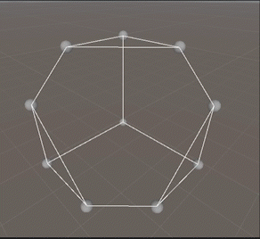

# Simplex Method Visualization

I really have no idea how far I'll get with this, but I think the hard part is over.

Currently, the program (game? It's built in Unity) can render
a polyhedron from a big pile of general form constraints,
so long as those constraints are only in three variables 
(and conform to a few other janky conditions, namely that any
geq constraints must have negative value of b, and any leq constraints must have a positive b).

It first finds the verticies of the polyhedron, and then
figures out how to connect together the big list of verticies.

To find the verticies, it finds all basic feasible solutions.
It iterates over every triplet of planes, finds where
they intersect (if they intersect), and records the associated basic variables.

After it generates a big list of sets of basic indicies,
it finds adjacent bases and draws edges between them. 

It was very neat to just use the content I learned in optimization
right off the bat, I figured I'd need a bunch of linear algebra just
to visualize the polyhedra, but what is a polyhedra other than
some verticies and some edges, and what's a vertex but a basic feasible solution.

The next step will be to actually run the simplex method,
but that's a much more straightforward process than
figuring out how to visualize the feasible set.

Some of the concepts are a little backwards. 
I claimed earlier that it records all of the associated
bases, when in reality it actually records the three 
linearly independent constraints that intersect at that point.
If I had better linear algebra tools, I could implement
that faithfully, but all I can work with easily are 3 or 4 vectors,
and 4x4 matricies.